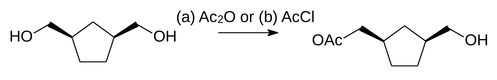
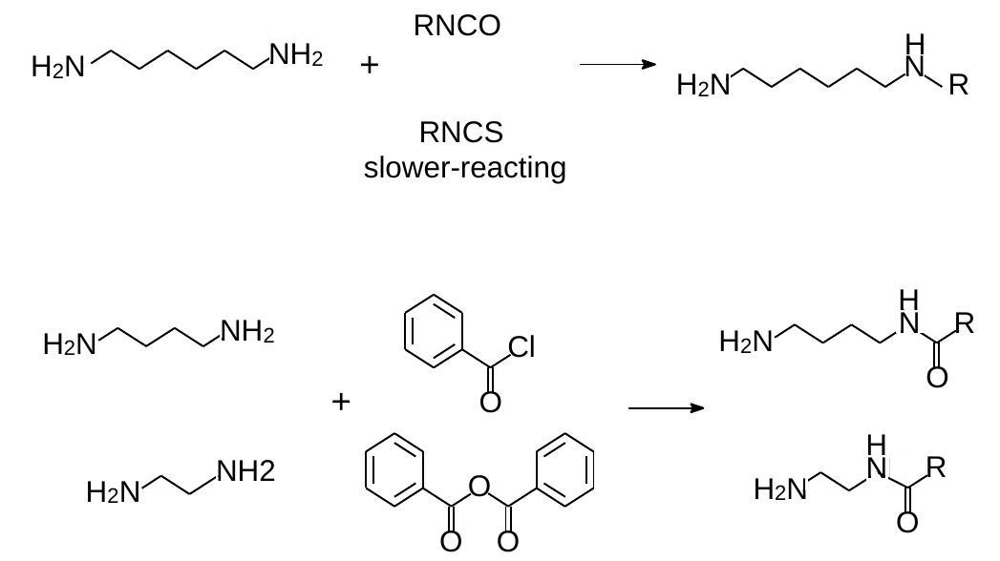
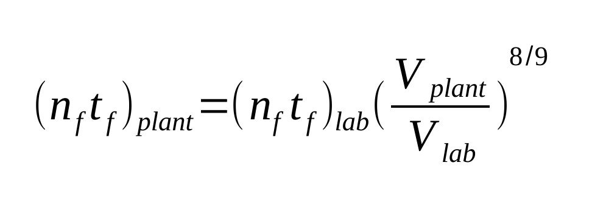

Dropwise operation is necessary for every reactions ??
==============================================================

| How to obtain high ratio monoester? Which reagent is more acceptable,
  acetic chloride or acetyl anhydride? What kind of control is
  required for the time of adding reagents and the way of feeding?
  And Why?
| 5 examples in Bourne paper [1]

| **Blending time** is established based on a practical, realistically achievable value such as 99% uniformity.
| Blending of miscible liquids happens slowly by **molecular diffusion** and **natural convection**. Thus, agitation systems
  can apply forced convection to obtain homogeneity more rapidly
  (Rushton, 1956) [2].
| Blending time is usually about 1 min in 1000 gal vessel under
  energy input W/I = 0.02 [3, page 247]

| **Power per unit volum (P/V)**
| Generally, either **power per unit volume (P/V) or torque per unit volume (Tq /V) should be held constant on scale-up**. Scale-up methods established on constant blend time demand that the agitation speed in the plant vessel be similar to that of the laboratory vessels [2].
| Mixing course: Useful clues for the mixing beginners—Better Mix, Better Process [4].

| **Kolmogorov microscale** are the smallest scales in turbulent flow [6, page 20].
| Diffusion is generally regarded as a slow process. Within eddies of 30~100um diameter, homogeneity is achieved in about 1s for low-viscosity fluids [5].

| **Mixing on Micro-scale** [6, page 20 and 21]
| Mixing sensitivity of competitive - consecutive fast reaction scheme
| Kinetics limit, show reaction regime Xs->0 and instantaneout reaction regime Xs->1
| Timescales of mixing - 3 different types and properties of Macro-mixing, meso-mixing and micro-mixing

| **Feed location on scale-up** [6, page 28]
| Xs is 0.03~0.06 if feed location is near the impeller zone
| Xs is about 0.22 if feed location is on the surface of mixture in vessel
| 3 different types of controlled addition reactions - addition tube (dip pipe), dispersion ring and spray nozzle [3, page 258].
| Spray nozzle is desgined for sensitivity for temperature and dip pipe is designed for sensitivity for concentration. If your reaction is sensitiviy for temperature and concentration both, using the dispersion ring is first choice.

| **Screening experiments** [1]
| Sequence showing the minimum experiments which must be carried out (Figure 23). Stirrer speed, feed time, feed point position, number of feed points and viscossity of solution are used to identify the type of mixing.

| **Micro-mixing** [8]
| For example, to preserve constant reaction selectivity on scale-up for reactions exhibiting micromixing control, Bourne shows that Eqs. 1 and 2 are applicable for a competitive reaction sequence when able to maintain geometric similarity and constant P/V.

| **Meso-mixing** [1]
| If mesomixing controls, requiring its time constant (ts) to be held constant, a difficulty can arise.
| the product distribution can only be held constant if the feed time is significantly extended with increasing vessel size. The penalty is now a substantial fall in productivity upon scale-up. It was shown that the best way out is to **increase the number of feed points** in the large vessel.

| **Mixing and Chemical Reactions (Troubleshooting Charts for Reactions)** [8,9]
| Dip pipe or subsurfaced Feed, Liqiud Reaction, Solid-Liquid Reaction and Reaction in Liquid Liquid Dispersion

| **Conclusion:**
| To dissolve the reagents in a solvent and quickly add them to the area near the impeller is first choice.
| Acetyl anhydride is preferred over acetic chloride because the relationship between reaction time and blend time.

References
----------------------------------------------

1. J. R. Bourne., *Org. Process Res. Dev.* **7**, 471−508 (2003).
2. R. A. Ghotli, A. A. A. Raman, S. Ibrahim and S. Baroutian *Chemical Engineering Communications* **200** (5), 595-627, (2013).
3. David J. am Ende and Mary Tanya am Ende *Chemical engineering in the pharmaceutical industry - drug product design, development and modeling*, 2nd Ed., Wiley (2019).
4. https://www.shi-pe.shi.co.jp/english/technology/index.html
5. `Chapter 6 mixing <https://www.google.com.tw/url?sa=t&rct=j&q=&esrc=s&source=web&cd=&ved=2ahUKEwjT7qKKpY_9AhUSBt4KHQbVDGoQFnoECA0QAQ&url=https%3A%2F%2Fwww.researchgate.net%2Fprofile%2FPrem_Baboo%2Fpost%2FWhat_is_the_required_power_of_submerged_mixer_in_equalization_tank_before_ABR%2Fattachment%2F59d626b379197b8077984f88%2FAS%253A322848827084801%25401453984566680%2Fdownload%2F7-110415153545.pdf&usg=AOvVaw1yAAel74uHZwjk-iLMUVYa>`_
6. `AIChE Mixing <https://mixing.net/Featured/AIChE%20STUDENT%20CONF%202019.pdf>`_
7. D. J. am Ende, C. B. Seymour and T. J. N. Watson *J. Pharm. Innov.* 72-78 (2010).
8. Edward L. Paul, Victor Atiemo-Obeng, Suzanne M. Kresta *Handbook of industrial mixing: Science and Practics*, 1 st Ed., Wiley-Interscience (2003).
9. Suzanne M. Kresta, Arthur W. Etchells III, David S. Dickey, Victor A. Atiemo-Obeng, North American Mixing forum *Advances in Industrial Mixing : a Companion to the Handbook of Industrial Mixing*, 1st Ed., Wiely (2015).

