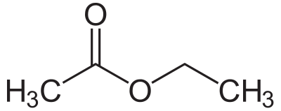
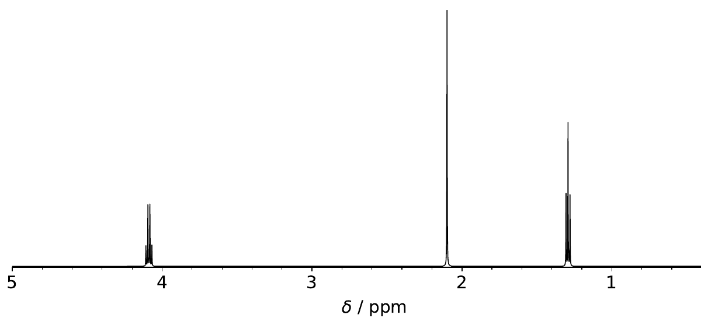

Ethyl Acetate
============================================================

2D Structure of Ethyl Acetate

Computation of NMR spectrum (Censo)

| mkdir 01.crest // Create a folder (Crest)
| save as crest.sh (below) in new folder (vim or ed)
| chmod +x crest.sh
| run ./crest.sh
| Content of crest.sh

.. code-block:: bash

 #!/bin/bash
 mkdir -p crest
 cd crest
 crest ../traj.xyz  --quick -nmr | tee  ../crest/traj.out
 cp anmr_nucinfo anmr_rotamer coord crest_conformers.xyz ../
 cd ..

| crest_conformers.xyz

.. code-block:: bash

  14
        -20.78784646
 C          1.4010409226        0.2796117721       -0.5784479724
 O          0.1045660078        0.7734882563       -0.2372423335
 C         -0.8641545991       -0.1289673683       -0.0457661648
 C         -2.1518900425        0.5450699596        0.3504645117
 H         -2.1747835893        1.5627433803       -0.0258723504
 H         -2.2088834011        0.5689991018        1.4372130740
 H         -2.9942793561       -0.0274935245       -0.0261081331
 O         -0.7147180397       -1.3149983495       -0.1729183217
 C          2.1825494672       -0.1355968913        0.6597013301
 H          1.8921644943        1.1061187084       -1.0961204996
 H          1.2871432206       -0.5723198272       -1.2568447540
 H          3.1832333951       -0.4449698805        0.3721264393
 H          1.6842156057       -0.9680362066        1.1504212302
 H          2.2533787745        0.6960472734        1.3567421561
  14
        -20.78700044
 C          1.3763474866       -0.2975891783       -0.0546001006
 O          0.1789203760        0.4428264323        0.1934800968
 C         -0.9740147370       -0.1728416844       -0.0824719776
 C         -2.1508798472        0.7067904388        0.2501451204
 H         -2.5165835648        0.4359846209        1.2388896358
 H         -2.9475255405        0.5359013091       -0.4679556660
 H         -1.8509726748        1.7497065865        0.2559377530
 O         -1.0434994819       -1.2880656888       -0.5270626221
 C          2.5642880516        0.6060498003        0.2156649189
 H          1.3657307426       -0.6469681219       -1.0930871645
 H          1.3877006381       -1.1775899277        0.5984306059
 H          2.5459388855        0.9497588453        1.2462843228
 H          2.5330117481        1.4722752052       -0.4396750104
 H          3.4859563870        0.0593836511        0.0389397893
  14
        -20.78696127
 C          1.3787757084       -0.3233080998        0.0618166294
 O          0.1755994188        0.4247978896        0.2506289732
 C         -0.9717111612       -0.1775912588       -0.0753186519
 C         -2.1465390235        0.7264458995        0.1930514379
 H         -1.9136579757        1.7405091246       -0.1180243687
 H         -2.3463081150        0.7325796057        1.2626224536
 H         -3.0209159017        0.3540165881       -0.3313897244
 O         -1.0393423151       -1.2942096125       -0.5159880999
 C          2.5531318643        0.6371948928        0.0850120995
 H          1.3150066308       -0.8590406031       -0.8916763368
 H          1.4588802317       -1.0645113871        0.8652274843
 H          2.4601133601        1.3640556945       -0.7174451208
 H          3.4790202625        0.0840233976       -0.0423040117
 H          2.5826737012        1.1682391519        1.0325574944
  14
        -20.78697713
 C          1.3853258682       -0.1802862451       -0.2769178349
 O          0.1763797498        0.4969599517        0.0744695405
 C         -0.9687609037       -0.1721071125       -0.0833298370
 C         -2.1474699018        0.6686059811        0.3340205887
 H         -1.8101388349        1.6264734394        0.7159007518
 H         -2.7129601240        0.1361935180        1.0948498517
 H         -2.7980736188        0.8166678961       -0.5247611655
 O         -1.0349782979       -1.2976162419       -0.5020055856
 C          2.5423565339        0.4846785482        0.4456852623
 H          1.5128753998       -0.1198996012       -1.3637389624
 H          1.2905584314       -1.2360348346       -0.0005796433
 H          2.6021834393        1.5338339891        0.1690183777
 H          3.4718244880       -0.0082258373        0.1760337964
 H          2.4031677524        0.4165002954        1.5213591562
  14
        -20.78364296
 C          1.3947528124       -0.0687167632       -0.4008136236
 O          0.1640387700        0.5567757384       -0.0249006497
 C         -0.9561374831       -0.1685875689       -0.0851827772
 C         -2.1419647694        0.6387328864        0.3758246851
 H         -1.8551606025        1.6728725634        0.5358623291
 H         -2.5179400641        0.2113964183        1.3028657837
 H         -2.9314074810        0.5731749297       -0.3683902212
 O         -1.0016270893       -1.3128545316       -0.4522412463
 C          2.4964755245        0.3573505227        0.5697455597
 H          1.6203357777        0.2451372181       -1.4247786140
 H          1.2402978336       -1.1523017068       -0.3971785047
 H          2.9319528320       -0.5020294895        1.0708347785
 H          2.0704989822        1.0149272740        1.3232389689
 H          3.2857258834        0.8965524789        0.0550180571

| Create new folder (02.GFN2) and copy crest_conformers.xyz to new folder. Rename crest_conformers.xyz to traj.xyz
| Executive molculus and use settings.ini
| GFN2 under alpb CHCl3 solvent and charge (0) UHF (0)

.. code-block:: bash

  iprog= 4  // The computational code to invoke. 1: Gaussian, 2: MOPAC, 3: ORCA, 4: xtb, 5: Open Babel
  ngeom= 0  
  itask= 0 
  ibkout= 0 
  distmax= 999 
  ipause= 0 
  iappend= 0 
  freeze= 0  
 --- Below for xtb ---
 xtb_arg= "--gfn 2 --alpb CHCl3 --chrg 0 --uhf 0"  

| When molculus is completed, isomers.xyz will be produced.
| Run cregen.sh
| When the cregen.sh is completed, cluster.xyz will be produced.
| Create new folder and copy cluster.xyz to new folder. Rename cluster.xyz to traj.xyz
| Executive molculus and use settings.ini and template.inp
| Content of settings.ini

.. code-block:: bash

  iprog= 3  // The computational code to invoke. 1: Gaussian, 2: MOPAC, 3: ORCA, 4: xtb, 5: Open Babel
  ngeom= 0  
  itask= 0 
  ibkout= 2 
  distmax= 999 
  ipause= 0  
  iappend= 0  
  freeze= 0  
 --- Below for ORCA ---
  orca_path= "/home/vitamin/orca_5_0_2_linux_x86-64_shared_openmpi411/orca"  // Command for invoking ORCA
  ibkgbw= 1  // The same as ibkout, but for .gbw file
  ibktrj= 1  // 1: Backup optimization trajectory (trj.xyz) with step number in the file name, 0: Don't backup
  ibkhess= 1  // 1: Backup .hess file with step number in the file name, 0: Don't backup

| Content of template.inp

.. code-block:: bash

 ! r2SCAN-3c opt miniprint PAL8 CPCM(chloroform) noautostart 
 %maxcore 6000
 
 * xyz 0 1 
 [GEOMETRY]
 *
 
| When molculus is completed, isomers.xyz will be produced.
| Executive cregen.sh
| When the cregen.sh is completed, cluster.xyz will be produced.
| Content of isomers.xyz

.. code-block:: bash

       ==============================================
       |                                            |
       |                 C R E S T                  |
       |                                            |
       |  Conformer-Rotamer Ensemble Sampling Tool  |
       |          based on the GFN methods          |
       |             P.Pracht, S.Grimme             |
       |          Universitaet Bonn, MCTC           |
       ==============================================
       Version 2.11.2, Fr 17. Dec 12:10:44 CEST 2021
   Using the xTB program. Compatible with xTB version 6.4.0
 
    Cite work conducted with this code as
 
    P. Pracht, F. Bohle, S. Grimme, PCCP, 2020, 22, 7169-7192.
 
    and  S. Grimme, JCTC, 2019, 15, 2847-2862.
 
    with help from:
    C.Bannwarth, F.Bohle, S.Ehlert, S.Grimme,
    C. Plett, P.Pracht, S. Spicher
 
    This program is distributed in the hope that it will be useful,
    but WITHOUT ANY WARRANTY; without even the implied warranty of
    MERCHANTABILITY or FITNESS FOR A PARTICULAR PURPOSE.
 
  Command line input:
  > crest isomers.xyz --cregen isomers.xyz --rthr 0.25 --bthr 0.02 --ethr 0.10 --ewin 4.0
 
   --cregen : CREGEN standalone usage. Sorting file <isomers.xyz>
   --rthr 0.25
   --bthr 0.02
   --ethr 0.10
   --ewin 4.0
  Using only the cregen sorting routine.
  input  file name : isomers.xyz
  output file name : isomers.xyz.sorted
  number of atoms                :   14
  number of points on xyz files  :   3
  RMSD threshold                 :   0.2500
  Bconst threshold               :   0.0200
  population threshold           :   0.0500
  conformer energy window  /kcal :   4.0000
  # fragment in coord            :     1
  # bonds in reference structure :    13
  number of reliable points      :     3
  reference state Etot :  -307.650688240000
  running RMSDs...
  done.
  number of doubles removed by rot/RMSD         :           0
  total number unique points considered further :           3
        Erel/kcal        Etot weight/tot  conformer     set   degen     origin
        1   0.000  -307.65069    0.39253    0.76807       1       2
        2   0.026  -307.65065    0.37553
        3   0.312  -307.65019    0.23193    0.23193       2       1
 T /K                                  :   298.15
 E lowest                              :  -307.65069
 ensemble average energy (kcal)        :    0.082
 ensemble entropy (J/mol K, cal/mol K) :    8.928    2.134
 ensemble free energy (kcal/mol)       :   -0.636
 population of lowest in %             :   76.807
  number of unique conformers for further calc            2
  list of relative energies saved as "crest.energies"
 
  -----------------
  Wall Time Summary
  -----------------
               CREGEN wall time :         0h : 0m : 0s
 --------------------
 Overall wall time  : 0h : 0m : 0s
 
  CREST terminated normally.

| only two conformers in cluster.xyz 
| Copy the folder 01.Crest to new folder 04.Censo and copy to cluster.xyz to new folder and rename to crest_conformers.xyz
| Run censo -inp crest_conformers.xyz | tee crest_conformers.out
| After 3 minutes the censo is completed. 
| Run anmr -lw 1 -mf 500 -mss 12 and use .anmrrc setting 
| Run ./nmmrplot.py -i anmr.dat to afford nmr spectrum

| Content of .anmrrc

.. code-block:: bash

 7 8 XH acid atoms
 ENSO qm= ORCA mf= 500.0 lw= 1.0  J= on S= on T= 298.15 
 TMS[chcl3] pbe0-d4[SMD]/def2-TZVP//r2scan-3c[SMD]/def2-mTZVPP
   1  31.79     0.0     1 
   6  188.57    0.0     0

